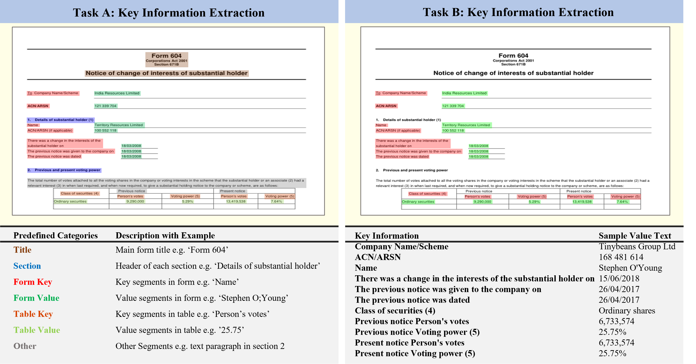

# Form-NLU: Dataset for the Form Language Understanding

We are excited to announce that the official release of our entire dataset, complete with tutorials and code, is scheduled for September 2023. However, if you are interested in accessing the dataset before the official release, we are providing an opportunity for early access.

How to get Early Access?
Email Us: Send an email to [yihao.ding@uwa.edu.au] with the following details:

**Organization**: Name of your organization.
**Intention**: Briefly describe why you want access to the dataset and how you plan to use it.
Dataset Link: Once we receive your email and evaluate your request, we will provide you with a link to access the dataset.

Why Early Access?
Early access will allow you to start working with the dataset ahead of time and provide us with valuable feedback that can help us improve the dataset and associated resources before the official release.

Feedback
We encourage early-access users to share their feedback, suggestions, or any issues encountered using the dataset. Please email your feedback to [yihao.ding@uwa.edu.au].

Note
The dataset provided during early access may be subject to changes and updates before the official release. Please keep this in mind while working with the dataset.

Thank you for your interest and support! We look forward to your contributions in making this dataset better.

This repository contains code for the paper [Form-NLU: Dataset for the Form Language Understanding](https://arxiv.org/abs/2304.01577)
__
Yihao Ding, Siqu Long, Jiabin Huang, Kaixun Ren, Xingxiang Luo, Hyunsuk Chung, Soyeon Caren Han
__
__
University of Sydney and University of Western Australia
__

We introduce a new dataset for form structure understanding and key information extraction. This repository will provide detailed baseline model descriptions and experimental setups to ensure our model and experiments are reproducible. As well as we will offer a colab link to show how to download and use our dataset for corresponding tasks.   Currently, we will only provide a few samples of our Form-NLU. We will update the GitHub and a [colab tutorial](https://colab.research.google.com/drive/1m399VuMHU3zKvXQdtZAWAediPUE8hhQc) to ensure our model and dataset is public available after our paper is published. 

## Baseline Model Description
### Baseline Description
Here we introduce the baselines adopted in our project.

**VisualBERT**: is a transformer-based pretrained model which can jointly learn the contextual vision and language representations of input text and image regions.

**LXMERT**: proposes a three transformer encoder-based pretrained vision language model on increasing the ability to learn vision and language semantic connections.

**M4C**: a multimodal transformer encoder-decoder architecture designed for visual question answering of which inputs contain representations of the question, OCR tokens, and detected image object features for iteratively decoding the answers from input OCR tokens or fixed answer space. 

### Baseline Setup
**VisualBERT, LXMERT**: we feed the key text content and extract 2048-d visual features of each segment from the Res5 layer of ResNet101 into pretrain vision-language models to learn the relation between segments and key contents. The enhanced visual representation of each segment will be fed into a pointer network to acquire a score for each segment. A softmax function is applied to predict the counterpart value index of the input key.

**M4C**: we slightly change the input features and output layers of the original M4C models to suit Task B demands. Firstly, OCR-extracted text representations are replaced by BERT *[CLS]* token features, fed into the transformer encoder with key text content and segment visual features. Additionally, we use a pointer network to replace the originally adopted dynamic pointer network on the top of the transformer decoder to predict the index of the corresponding value. Except for the above two aspects, we utilize the same transformer encoder-decoder structure as the original M4C model.
## Multi-aspect Features
**Visual Feature** (V): is used to numerically represent the appearance features of each input RoI by using 2048-d vectors extracted from the Res5-layer of ResNet-101 pretrained on ImageNet. 

**Textual Features** (S): aims to represent the semantic meaning of RoI's text content (acquired from OCR or PDFminer). We extract *[CLS]* token representations by feeding the tokenized text into pretrained *BERT-base-uncased* to generate a 768-d textual feature for each RoI. 

**Positional Features** (P): aims to comprehensively physical layout structure of form appearance. It is normalized bounding box coordinates $(\frac{x_i}{W},\frac{y_i}{H},\frac{w_i}{W},\frac{h_i}{H})$ of each input RoI where $W$ and $H$ are width and height of corresponding input page. 

**Density Features** (D): could effectively enhance segment representations which have been demonstrated by [DocGCN](https://github.com/adlnlp/doc_gcn). We use normalized number of characters $norm\_{num^{char}\_i} = \frac{num^{char}\_i}{max(num^{char})}$, where $max(num^{char})$ represents the maximum number of characters among all segments. Additionally, we also use $den^{char}_i = \frac{num^{char}_i}{(w_i \times h_i)}$ to represent the text density which is concatenated with $norm\_num^{char}_i$ to represent $Den_i$ of i-th input $r_i$.

**Gap Distance Features** (G): aims to represent the spatial relationship between neighbouring entities, which is the gap distance between $r_i$ with four directions nearest RoIs (up, down, left, right), represented by $G_i = [gd_i^{u}, gd_i^{d}, gd_i^l,gd_i^r]$. Consequently, similar to $P$, we also use $W$ and $H$ to get the normalized $G_i^{norm} = [\frac{gd_i^{u}}{H}, \frac{gd_i^{d}}{H}, \frac{gd_i^l}{W},\frac{gd_i^r}{W}]$.

Regarding Task B, we employ various approaches to encode the vision and language features. Firstly, all Task B adopted baselines use pretrained BERT to encode key textual content. Moreover, for the visual aspect, VisualBERT, LXMERT, and M4C models utilize 2048-d features extracted from the Res5 layer of ResNet101. The maximum number of input key text tokens and the number of segments on each page are all defined as 50 and 41, respectively. Task A and B experiments are conducted on Tesla V100-SXM2 with CUDA11.2.

## Case Study Setup
We conduct a transfer learning case study on the FUNSD dataset. We manually select 200 valuable question-answer pairs from the original FUNSD dataset. The FUNSD subset of the case study will be released after this paper is accepted. Then we use the trained model on our dataset to test whether the model can predict the correct answer of input question-answer pairs of the FUNSD subset. When we feed the QA pair into the model, we replace the original question text with fixed keys used in Task B. If any key in 12 key sets can predict the correct question answer, we will count this sample as a True Positive sample for calculating accuracy.
## Dataset Loading and Samples
We provide an [colab notebook](https://colab.research.google.com/drive/1m399VuMHU3zKvXQdtZAWAediPUE8hhQc) to ensure researchers in both academic and industrial areas can access our Form-NLU.

## Citation
TBA
